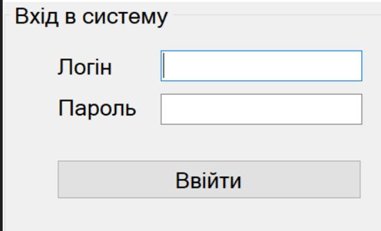
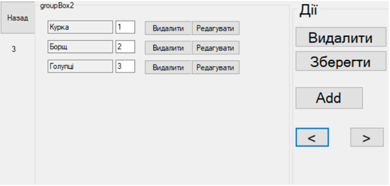
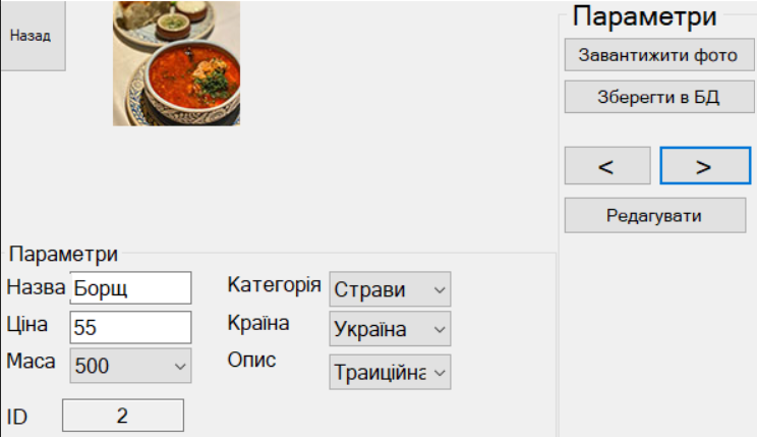
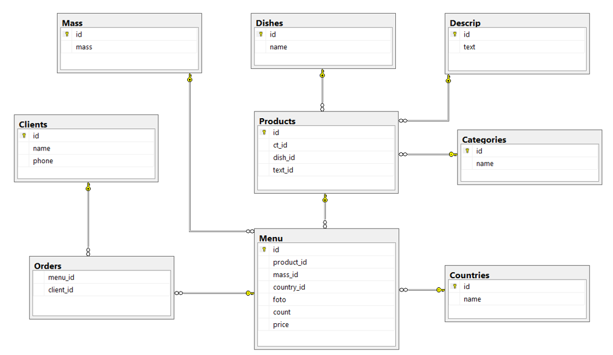
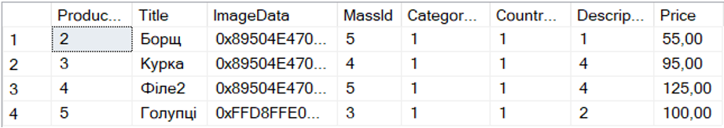
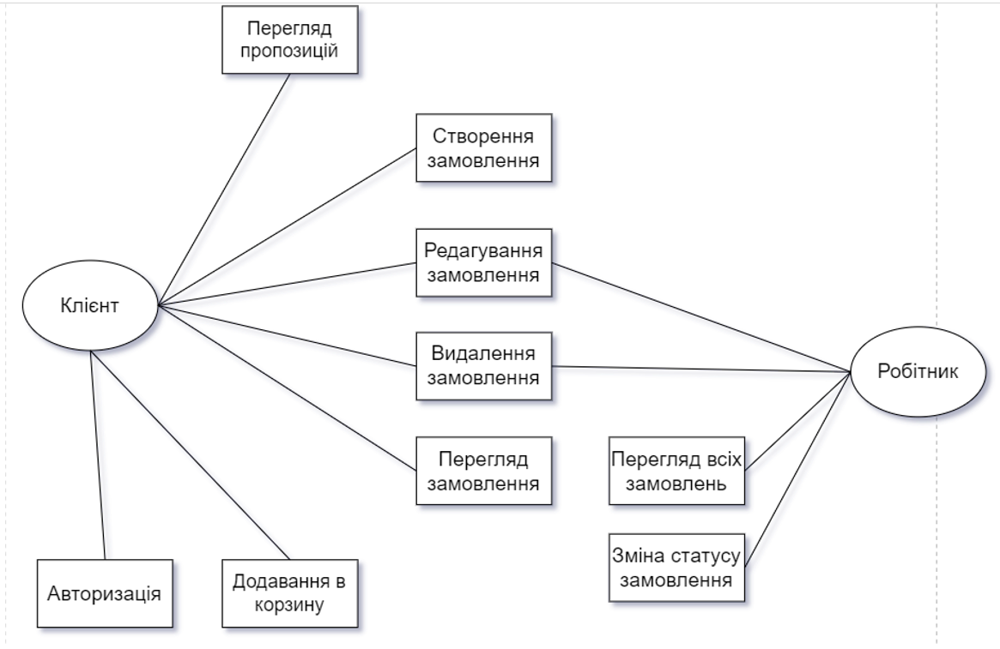

# Restaurant-customer-service
The goal of the project is to automate a specific stage in the food service industry, specifically a dining establishment, through a app. This includes all processes and functionalities such as menus, ordering, order tracking, and safety checks, encapsulated within the app. 

This project was created in the C# programming environment using the .NET Framework, and its interface was developed using WindowsForms.
The system itself interacts with an external database consisting of related tables. The database was created using SQL Server and supports all types of integrity. The interaction between the program and the database is done using ADO.NET technology.
### Interface
#### System login

#### Order management

#### Menu item creation

### Database
For the project, a relational database was implemented in SQL Server. An example is provided below.

#### Example of populating the 'Product' table in the database.

#### Application task diagram based on user role.

